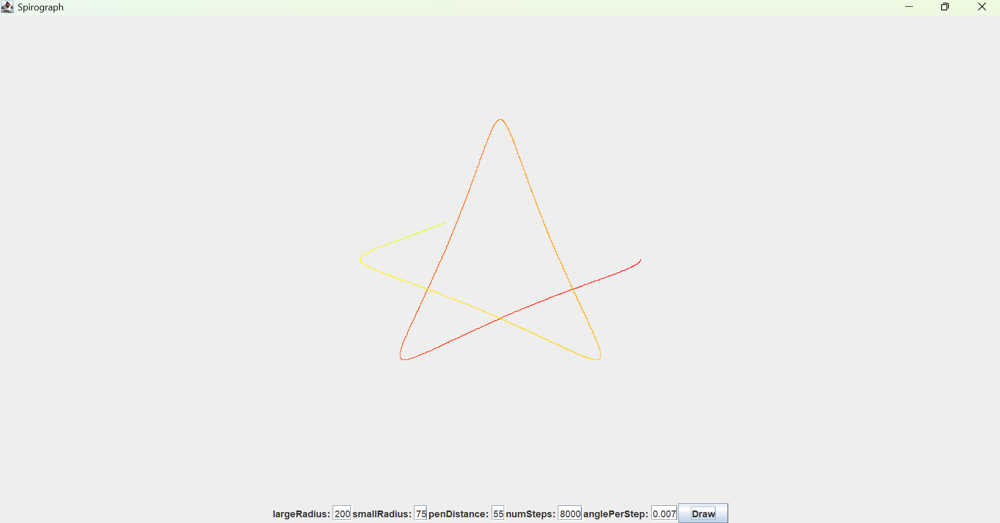

### Spirograph

By entering the radius of the large and small circles, a pen distance, number of steps (how far it goes), and a small angle, you can get colorful geometric shapes known as a spirograph

### Screenshots

#### Links

- [Junit Tests](https://junit.org/)
-  [Jcomponent](https://docs.oracle.com/javase/8/docs/api/javax/swing/JComponent.html)
- [GitHub](https://github.com/)